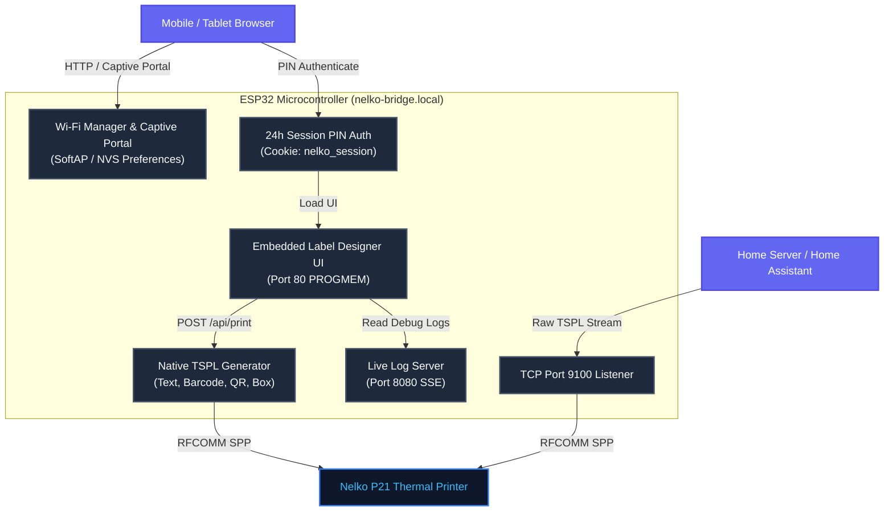
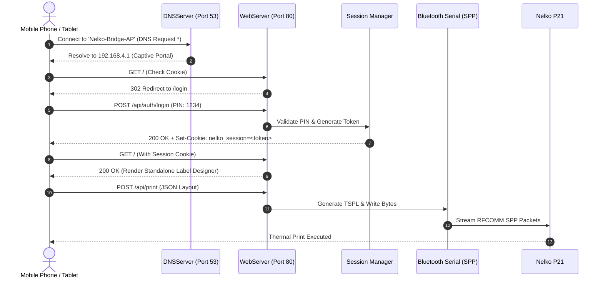
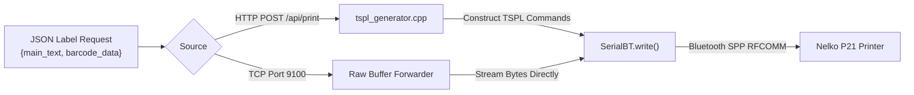

# ESP32 Nelko P21 Wireless Label Server & Print Bridge `v1.0.0`

[](https://github.com/spelech/esp32-LabelPrinter/actions/workflows/build.yml)


An autonomous, zero-server wireless print bridge and embedded label designer hosted on an **ESP32-WROOM-32** board. It relays TSPL printing streams over **Bluetooth Classic (SPP/RFCOMM)** to a **Nelko P21** thermal label printer.

---

## Architecture & System Overview



---

## Key Features

1. **Standalone Embedded Label Designer:** Host a complete HTML5/JS label creator directly inside the ESP32's flash memory. Design labels with text, barcodes, QR codes, and custom borders with **zero internet or home server required**.
2. **Strict Captive Portal & Hotspot (`Nelko-Bridge-AP`):** Automatically creates a Wi-Fi hotspot (`192.168.4.1`) if home Wi-Fi is unavailable or unconfigured. A built-in DNS server captures all domain requests (`* -> 192.168.4.1`) to pop open the portal immediately on iOS and Android devices.
3. **24-Hour PIN Session Authentication:** Security-enabled portal access requiring a PIN passcode (default `1234`). Upon authentication, an HTTP cookie (`nelko_session`) is issued, valid for **24 hours**.
4. **On-Device Native TSPL Generator:** Converts simple JSON label parameters directly into 1-bit monochrome TSPL byte streams natively on the ESP32 CPU.
5. **Multi-Client TCP Relay (Port 9100):** Acts as a standard JetDirect print server on TCP Port `9100`, allowing Home Assistant, cURL, or server stacks to stream raw TSPL print jobs over Wi-Fi.
6. **Live SSE Log Console (Port 8080):** Streams real-time diagnostic output directly to web browsers using Server-Sent Events (SSE).

---

## Connection & Captive Portal Sequence



---

## TSPL Data Flow Chart



---

## Status LED Indicator Reference

| LED Pattern | System State | Description |
| :--- | :--- | :--- |
| **Fast Flash (100ms)** | SoftAP Hotspot Active | Device is broadcasting `Nelko-Bridge-AP`. Connect phone to configure Wi-Fi. |
| **Slow Flash (500ms)** | Wi-Fi Station Active | Connected to home Wi-Fi; searching/pairing Bluetooth printer. |
| **Solid ON** | System Fully Ready | Wi-Fi (or SoftAP) AND Bluetooth printer are connected & operational. |

---

## Configuration & Credentials

Sensitivity parameters (SSID, Wi-Fi password, Bluetooth MAC address, default PIN) can be configured by creating a private `config_local.h` file (ignored by Git) in the project directory:

```cpp
#ifndef CONFIG_LOCAL_H
#define CONFIG_LOCAL_H

// Local Private Credentials Override
#define WIFI_SSID "YourHomeWiFi"
#define WIFI_PASS "YourWiFiPassword"
#define PRINTER_MAC {0x00, 0x11, 0x22, 0x33, 0x44, 0x55} // Nelko P21 Bluetooth MAC
#define DEFAULT_PORTAL_PIN "1234"

#endif
```

---

## REST API Reference

### 1. Authenticate Session
- **Endpoint:** `POST /api/auth/login`
- **Body (`application/x-www-form-urlencoded`):** `pin=1234`
- **Response:** `200 OK` + `Set-Cookie: nelko_session=<token>; Max-Age=86400; Path=/`

### 2. Scan Local Wi-Fi Networks
- **Endpoint:** `GET /api/wifi/scan`
- **Headers:** `Cookie: nelko_session=<token>`
- **Response:** `[{"ssid":"HomeWiFi","rssi":-62,"encryption":"WPA2"}]`

### 3. Save Wi-Fi Credentials
- **Endpoint:** `POST /api/wifi/save`
- **Body:** `ssid=HomeWiFi&pass=SecretPass`
- **Response:** Saves parameters to NVS memory and reboots device.

### 4. Direct HTTP Print
- **Endpoint:** `POST /api/print`
- **Headers:** `Content-Type: application/json`
- **Body:**
  ```json
  {
    "width_mm": 14.0,
    "height_mm": 40.0,
    "main_text": "PRICE: $4.99",
    "subtitle": "ITEM #1042",
    "barcode_data": "1042598",
    "border_thickness": 2
  }
  ```
- **Response:** `{"status":"success"}`

---

## Compiling & Flashing

### Option A: Using GitHub Actions (Precompiled Binary)
1. Every commit to `main` / `master` triggers the [Build Workflow](.github/workflows/build.yml).
2. Download the compiled firmware `.bin` artifact from GitHub Actions.
3. Flash directly using [ESP Web Tools](https://web.esphome.io/) or `esptool.py`.

### Option B: Using Arduino IDE
1. Install **Arduino IDE 2.0+**.
2. Go to *Tools -> Board -> Board Manager* and install **esp32** by Espressif Systems.
3. Select **ESP32 Dev Module** as board target.
4. Select *Tools -> Partition Scheme -> Huge APP (3MB No OTA / 1MB SPIFFS)* (required to fit Bluetooth Classic + Wi-Fi + WebServer).
5. Open `esp32-LabelPrinter.ino` and click **Upload**.
