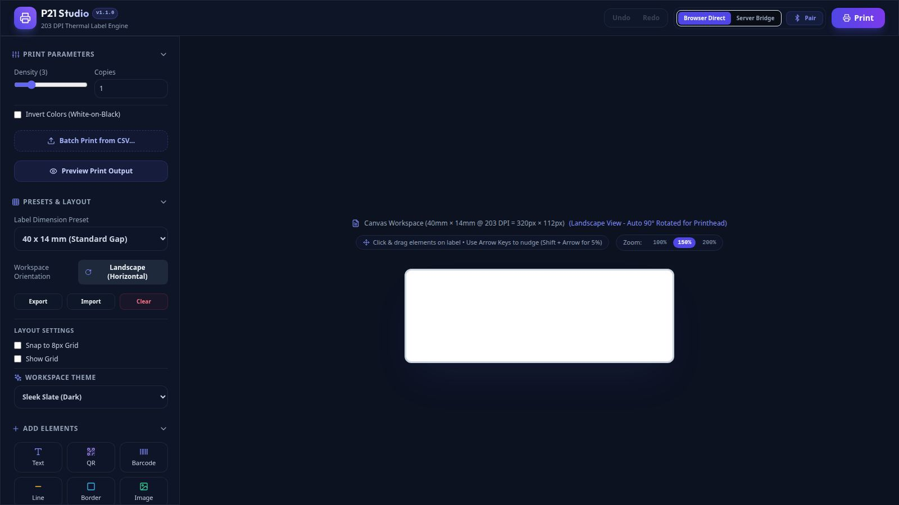
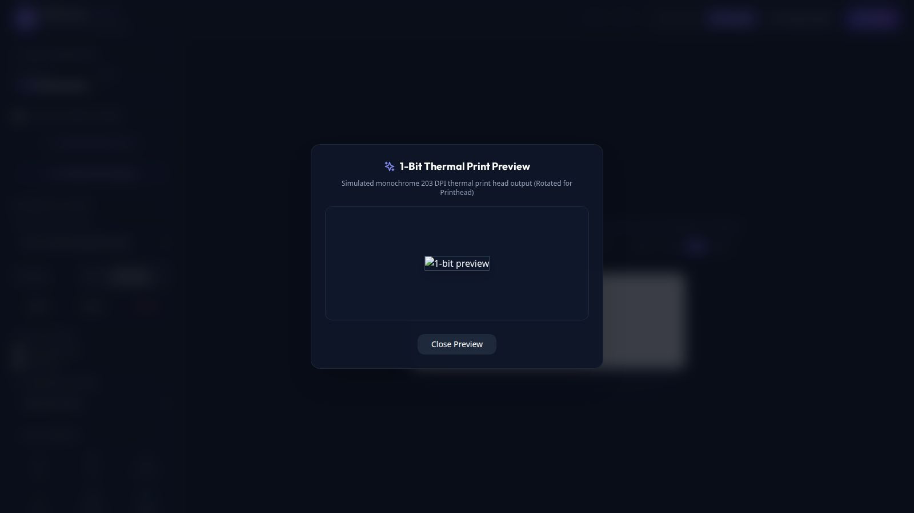
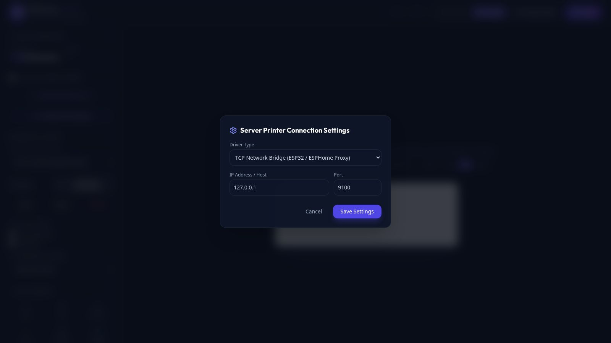

# Nelko P21 Web Print Suite

An open-source, containerized application suite for the **Nelko P21** thermal label printer (and compatible TSPL printers). Includes a **React Visual Label Designer**, **FastAPI REST API**, **FastMCP AI Server**, and multi-backend printer connection drivers.

---

## 🎨 Web Designer Interface

### 1. Visual Designer Studio UI (Landscape Workspace with Auto 90° Printhead Rotation)


### 2. 1-Bit Thermal Printhead Preview Modal


### 3. Driver & Connection Settings Modal


---

## ✨ Core Features

* **🎨 React Visual Label Studio**: Intuitive **Landscape Workspace** ($40 \times 14\text{mm}$, $30 \times 12\text{mm}$, $50 \times 15\text{mm}$, etc.) with real-time 203 DPI layout editing, text elements, QR codes, and barcodes.
* **📏 Layout Snapping & Center Guides**: Smooth canvas alignment guidelines snapping centers and margins to other elements or the layout center automatically.
* **📱 Browser-Direct Bluetooth (Web Bluetooth)**: Print directly from your iPhone, iPad, Android phone, or laptop browser to the printer right next to you anywhere in your house!
* **🔄 Automatic 90° Printhead Rotation**: Design horizontally for maximum readability—the engine automatically rotates the rendered 1-bit monochrome bitmap $90^\circ$ to fit the physical $14\text{mm}$ ($112\text{px}$) thermal printhead as paper feeds out.
* **🔤 Font Selections**: Selections for Monospace (perfect for serials or code blocks) and Sans-serif fonts rendered natively on both the browser canvas and backend print engine.
* **📶 Smart QR Content Generators**: Built-in template wizards for generating WIFI (SSID/password/auth), vCard contact, and Phone Call QR codes.
* **🔍 Touch Pinch-To-Zoom Gestures**: Multi-touch pinch zoom support for seamless layout designer usage on mobile phone screens.
* **🔒 Strict TypeScript & ESLint Pipeline**: Compiler-enforced JS/JSX typechecking (`tsc --noEmit` and JSDoc annotations) and ESLint rules protecting against ReferenceErrors.
* **🚀 FastAPI REST API**: Programmatically format and print labels from external scripts, Home Assistant, webhooks, or automation workflows.
* **🤖 FastMCP AI Tools**: Native Model Context Protocol server enabling AI assistants (Claude, Antigravity, LLMs) to print labels via natural language tool calls.
* **🔌 Flexible Connection Drivers**:
  * **TCP Network Bridge**: Connect over Wi-Fi to ESP32 bridges (e.g. `agiledivider/LabelPrinter-esp`) or ESPHome proxy nodes.
  * **Direct Bluetooth SPP**: Connect over Linux host Bluetooth stack (`PyBluez` / `/dev/rfcomm0`).
* **🧪 Automated Test Suite**: 100% passing unit & integration test suite (`python backend/tests/run_tests.py`).
* **🐳 Containerized & GHCR Pipeline**: Pre-built multi-architecture Docker images (`linux/amd64`, `linux/arm64`) published to GitHub Container Registry via automated SemVer workflows.

---

## 🚀 Deployment Guide (Linux Server with Docker Compose)

### 1. Quick Start with Docker Compose & `.env`

```bash
# Clone the repository
git clone git@github.com:spelech/NelkoP21WebPrint.git
cd NelkoP21WebPrint

# Create your environment file from template
cp .env.example .env

# Edit environment variables (set your ESP32 IP or driver settings)
nano .env

# Start the service (Pulls latest pre-built container from GHCR)
docker-compose up -d
```

Access the Web Studio at **`http://<your-server-ip>:8000`**.

### 2. Sample `.env` File (`.env.example`)

```ini
# Printer Driver Mode: 'tcp' (ESP32 Network Bridge / ESPHome Proxy), 'spp' (Direct Bluetooth), or 'mock'
PRINTER_DRIVER=tcp

# TCP Network Bridge Settings (ESP32 / ESPHome Proxy)
PRINTER_TCP_HOST=192.168.1.50
PRINTER_TCP_PORT=9100

# Direct Bluetooth SPP MAC Address (Linux host direct RFCOMM)
PRINTER_BT_MAC=00:11:22:33:44:55

# Web Application Port
PORT=8000
```

---

## 📡 REST API Overview

Interactive Swagger documentation is available at **`http://<your-server-ip>:8000/docs`**.

### Key Endpoints

#### 1. Print Text & Barcode Label
`POST /api/print`
```json
{
  "text": "ASSET-9921",
  "subtitle": "Server Rack B",
  "barcode": "ASSET-9921",
  "width_mm": 40,
  "height_mm": 14,
  "gap_mm": 5,
  "density": 3,
  "copies": 1
}
```

#### 2. Get Live 1-Bit Thermal Preview
`POST /api/preview`  
Returns a dithered 1-bit monochrome PNG image simulating the exact thermal printhead output.

---

## 🤖 FastMCP Server for AI Assistants

To connect the FastMCP server to Claude Desktop or Antigravity:
```json
{
  "mcpServers": {
    "nelko-printer": {
      "command": "docker",
      "args": ["exec", "-i", "nelko-p21-print", "python", "-m", "app.mcp.server"]
    }
  }
}
```

---

## 🧪 Running Unit & Integration Tests

```bash
# Run backend test suite
python backend/tests/run_tests.py
```

---

## 📂 Project Structure

```text
NelkoP21WebPrint/
├── docs/                       # Reverse-engineering documentation & diagrams
│   ├── README.md
│   ├── 01_HARDWARE_AND_BLUETOOTH.md
│   ├── 02_TSPL_PROTOCOL_SPEC.md
│   ├── 03_RASTERIZATION_AND_IMAGE_PROCESSING.md
│   ├── 04_DEVICE_MATRIX_AND_CONFIG.md
│   ├── 05_PAPER_PRESETS_AND_RFID.md
│   ├── 06_ESP32_MULTI_NODE_BRIDGE.md
│   ├── 07_SYSTEM_ARCHITECTURE.md
│   └── images/                 # Real Web UI Screenshots
├── backend/                    # Python FastAPI & FastMCP Server
│   ├── app/
│   │   ├── api/                # REST endpoints
│   │   ├── core/               # TSPL builder & 1-bit rasterizer
│   │   ├── drivers/            # Bluetooth SPP & TCP Network drivers
│   │   └── mcp/                # FastMCP AI tools
│   ├── tests/                  # Unit & integration test suite
│   └── requirements.txt
├── frontend/                   # React Visual Label Studio
│   ├── src/
│   │   ├── App.jsx             # Label Editor UI
│   │   ├── utils/              # Client-side Web Bluetooth & TSPL generator
│   │   └── main.jsx
│   └── vite.config.js
├── .github/workflows/          # GitHub Actions CI/CD & GHCR Release
├── .env.example                # Sample environment configuration
├── AGENTS.md                   # AI agent coding guidelines & rules
├── Dockerfile                  # Multi-stage Docker build
├── docker-compose.yml          # Docker Compose GHCR service
└── README.md
```

---

## 📜 License & Credits

* Reverse-engineered from the Nelko Android Application.
* Open-source project built for Home Assistant, maker, and AI automation community.
