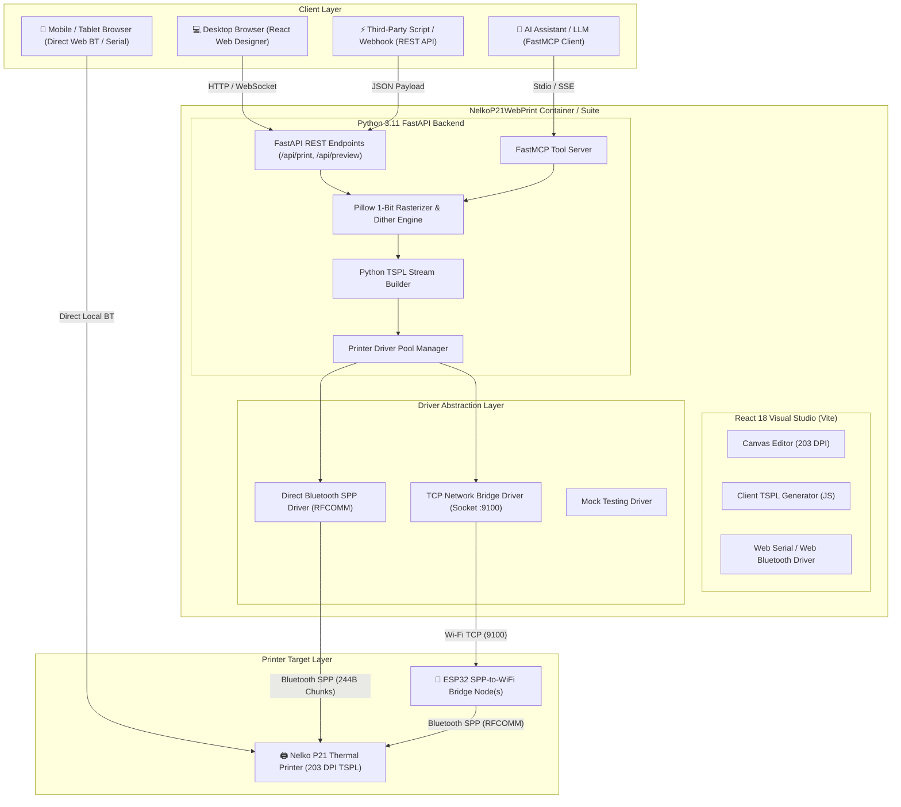

# 07. System Architecture & Component Design

This document details the high-level system architecture, data flow, component hierarchy, driver abstractions, and integration boundaries of **NelkoP21WebPrint**.

---

## 🏗 High-Level Architecture Diagram

---

## 🧩 Component Specifications

### 1. Frontend Layer (`frontend/src/`)
- **React 18 + Vite**: Fast SPA serving the visual studio.
- **`App.jsx`**: Layout orchestration, preset selection, element state management, modal controllers.
- **`utils/tsplGenerator.js`**: Pure JavaScript implementation of 203 DPI canvas rasterization, 1-bit MSB byte packing, and TSPL framing.
- **`utils/webBluetoothDriver.js`**: Manages Web Serial (`navigator.serial`) and Web Bluetooth (`navigator.bluetooth`) connections, handling 244-byte chunk streaming directly out of the client browser.

### 2. Backend API Layer (`backend/app/`)
- **FastAPI Core (`main.py`)**: Asynchronous REST framework serving API routes and mounting compiled static frontend assets.
- **`core/rasterizer.py`**: Converts PIL Image objects into 1-bit monochrome byte arrays supporting Floyd-Steinberg error diffusion and $16 \times 16$ Bayer matrix ordered dithering.
- **`core/tspl_builder.py`**: Generates exact ASCII + binary TSPL streams (`SIZE`, `GAP`, `SPEED`, `DENSITY`, `DIRECTION`, `CLS`, `BITMAP`, `PRINT`).

### 3. FastMCP AI Tools (`backend/app/mcp/server.py`)
Provides native Model Context Protocol tools for AI agents (Claude Desktop, Antigravity, LLM agents):
- `print_simple_label`: Renders and prints text + barcode/QR labels.
- `get_printer_status`: Checks connection state and driver configuration.
- `list_label_presets`: Returns available label physical dimensions.

### 4. Connection Drivers (`backend/app/drivers/`)
- **`spp_driver.py`**: Communicates directly over Linux `AF_BLUETOOTH` / PyBluez sockets to RFCOMM Channel 1 (`00001101-0000-1000-8000-00805F9B34FB`).
- **`tcp_driver.py`**: Connects to raw TCP sockets (port 9100) for ESP32 bridges or ESPHome proxy nodes.
- **`base_driver.py`**: Abstract base class enforcing `connect()`, `disconnect()`, `send_bytes()`, and `get_status()`.

---

## 🖼 UI Mockups & Architecture Visuals

### 1. Visual Designer Studio

### 2. 1-Bit Thermal Print Preview Modal

### 3. Connection Settings Modal

