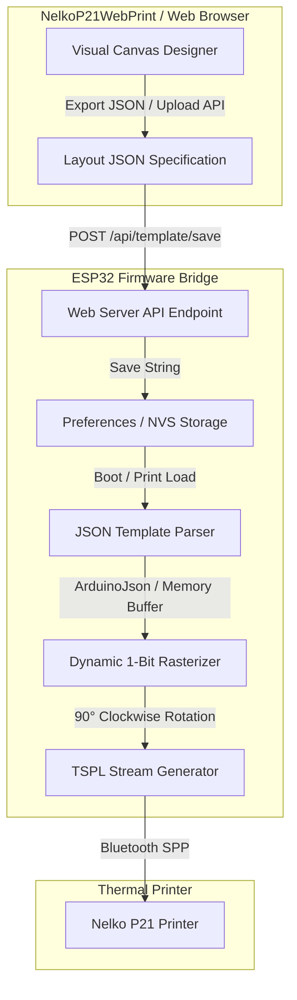

# Technical Design: ESP32 Dynamic JSON Template Engine & Layout Sync

**Date:** 2026-08-08  
**Target Repositories:** `esp32-LabelPrinter` (ESP32 C++ Firmware) & `NelkoP21WebPrint` (React Web Designer)

---

## 1. Overview & Objective
Currently, the ESP32 firmware (`esp32-LabelPrinter`) uses a hardcoded C++ label layout with fixed positions for main text, subtitle, and barcode. When users design custom label layouts in `NelkoP21WebPrint` (or export JSON layout files), the ESP32 cannot natively parse or render these custom visual layouts for standalone operation.

This design introduces a **Dynamic JSON Template Engine** on the ESP32 firmware. Users will be able to visually build, edit, and export label layouts in `NelkoP21WebPrint` (or the ESP32 embedded web designer), upload the `.json` layout file directly to the ESP32 (stored in non-volatile flash storage via `Preferences`), and have the ESP32 dynamically rasterize all visual components (Text, Code128 Barcodes, QR Codes, Lines, Rectangles) into physical TSPL printer commands.

---

## 2. System Architecture & Data Flow



---

## 3. JSON Layout Specification Schema

The ESP32 dynamic template engine will parse and execute the exact JSON schema exported by `NelkoP21WebPrint`:

```json
{
  "preset": {
    "name": "40 x 14 mm (Standard Gap)",
    "width": 40,
    "height": 14,
    "gap": 5
  },
  "elements": [
    {
      "id": 1723100000001,
      "type": "text",
      "content": "ORGANIC COFFEE",
      "fontSize": 16,
      "fontStyle": "normal",
      "fontFamily": "sans-serif",
      "x": 50,
      "y": 20
    },
    {
      "id": 1723100000002,
      "type": "line",
      "x": 50,
      "y": 38,
      "width": 80,
      "height": 2
    },
    {
      "id": 1723100000003,
      "type": "barcode",
      "content": "1042598",
      "barcodeType": "code128",
      "x": 50,
      "y": 68,
      "width": 90,
      "height": 28
    },
    {
      "id": 1723100000004,
      "type": "rectangle",
      "x": 50,
      "y": 50,
      "width": 96,
      "height": 92,
      "thickness": 2
    }
  ]
}
```

### Supported Component Specifications:
1. **Text Component (`type: "text"`)**:
   - `x`, `y`: Percentage coordinates (0-100%) on logical label canvas.
   - `content`: Text string. Supports variable substitution (e.g. `{{var}}` or dynamic parameters).
   - `fontSize`: Standard font scale mapper (mapped to 8x16 internal bitmapped font multipliers `1x`, `2x`, `3x`).
2. **Code128 Barcode Component (`type: "barcode"`)**:
   - `x`, `y`: Centered percentage coordinates.
   - `width`, `height`: Dimension in logical dots.
   - `content`: Alphanumeric text encoded using Code128 Subtype B pattern array.
3. **Line Component (`type: "line"`)**:
   - `x`, `y`: Center coordinates.
   - `width`, `height`: Thickness and length.
4. **Rectangle Component (`type: "rectangle"`)**:
   - `x`, `y`: Center coordinates.
   - `width`, `height`, `thickness`: Outer frame boundaries.
5. **QR Code Component (`type: "qr"`)**:
   - `x`, `y`: Center coordinates.
   - `size`: Dimension in logical dots.

---

## 4. Detailed Component Changes

### A. ESP32 Firmware (`esp32-LabelPrinter`)

#### 1. `tspl_generator.h` & `tspl_generator.cpp`
- Implement `generateTSPLFromJSON(const String& jsonTemplate, const SimpleLabelRequest& reqData)`:
  - Parse JSON string using `ArduinoJson` (v6/v7).
  - Allocate logical bitmap memory (`widthMm * 8` dots wide x `heightMm * 8` dots high).
  - Render elements in order onto the logical bitmap.
  - Apply 90° clockwise rotation mapping for physical 14mm Nelko printhead.
  - Return formatted binary TSPL packet string.
- Provide backward compatibility with legacy `generateTSPLStream(req)` if no JSON layout is stored.

#### 2. `web_server.cpp`
- **New API Endpoints**:
  - `POST /api/template/save`: Stores posted JSON payload string into `Preferences` namespace `"label-template"`, key `"layout"`.
  - `GET /api/template/load`: Returns currently active stored JSON template.
  - `POST /api/template/reset`: Deletes custom template, restoring default layout.
  - `POST /api/print`: Updates print handler to check if custom JSON template is active; if present, renders print job using stored JSON layout merged with incoming text/barcode parameters.
- **Embedded Web Portal UI**:
  - Add "Template Management" card to the Standalone Designer tab.
  - Include file picker / drag-and-drop zone to import `.json` files directly into ESP32 NVS memory.
  - Add "Export Active ESP32 Template" and "Reset to Factory Layout" buttons.

### B. Web Designer (`NelkoP21WebPrint`)

#### 1. `LayoutPresets.jsx` & `Header.jsx`
- Add "Push Layout to ESP32 Bridge" button next to "Export JSON".
- When clicked, sends an HTTP `POST` request to `http://<ESP32_IP>/api/template/save` with the current canvas JSON state.

---

## 5. Verification Plan

### Automated & Static Verification
1. **Compilation Check**: Run `npx tsc --noEmit` and `npm run lint` in `NelkoP21WebPrint`.
2. **ESP32 Build Verification**: Verify ESP32 code structure compiles cleanly with ArduinoJson dependency.

### Manual Verification
1. Export layout JSON from `NelkoP21WebPrint` canvas editor.
2. Upload JSON to ESP32 via `/api/template/save` or ESP32 Web UI file upload.
3. Trigger `/api/print` test request on ESP32 and confirm generated TSPL stream correctly matches visual coordinates of the custom JSON template.
